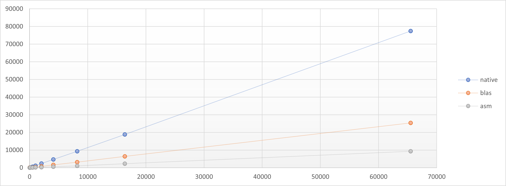

## About
    In today's view, we very often operate with a vector representation of objects, such as when working with text, graphics, neural networks, etc. Let's call a vector a certain sequence of numbers. Then we would like to somehow compare vectors with each other. Most often, but not always, thank goodness, cosine distance is used, which is defined and calculated quite simply:
   
   $$
   distance = (a * b) / (\sqrt{a^2} * \sqrt{b^2})
   $$

## What's the problem?
    There's no problem at all. The formula is simple and easy to program, but only until the vectors become large enough.

    The main problem is that the calculation is done in the old way, i.e. element by element. We step-by-step through an array and perform certain actions, while our processors have been supporting vector calculations for quite a long time, not to mention tensor GPUs. 

    Proof and links [howto a new way](https://www.techspot.com/article/2166-mmx-sse-avx-explained/)

## Compare    
    Let's compare the performance at different vector sizes of cosine distance calculation functions between two vectors, written natively in Golang, BLAS, Assembler.

    What is BLAS are routines that provide standard building blocks for performing basic vector and matrix operations. Yes it's code written in C with all it implies :) 
    I must also underline that as an example I am using a module written in Assembler with AVX256 and FMA support for the amd64 architecture.    

## How to build benchmarks

    Easy. 
    For local benchmarks:
   ```console
   make bench
   ```

   For containers benchmarks:
  ```console
  make cbench
  ```

## Data
    A little bit of data in the form of a table what i see at my laptop.
    To be clear all tests are writen in the same manner: 
    {Benchmark}{Native|Blas|Asm}/input_size_{32|128...}

    linux tests:

    | name                               | op/s        |
    | ---------------------------------- | ----------- |
    | BenchmarkNative/input_size_32-8    | 45.07 ns/op |
    | BenchmarkNative/input_size_128-8   | 152.5 ns/op |
    | BenchmarkNative/input_size_512-8   | 595.5 ns/op |
    | BenchmarkNative/input_size_1024-8  | 1195 ns/op  |
    | BenchmarkNative/input_size_2048-8  | 2392 ns/op  |
    | BenchmarkNative/input_size_4096-8  | 4755 ns/op  |
    | BenchmarkNative/input_size_8192-8  | 9631 ns/op  |
    | BenchmarkNative/input_size_16384-8 | 19372 ns/op |
    | BenchmarkNative/input_size_65536-8 | 78155 ns/op |
    | BenchmarkBlas/input_size_32-8      | 42.39 ns/op |
    | BenchmarkBlas/input_size_128-8     | 76.30 ns/op |
    | BenchmarkBlas/input_size_512-8     | 205.0 ns/op |
    | BenchmarkBlas/input_size_1024-8    | 411.4 ns/op |
    | BenchmarkBlas/input_size_2048-8    | 796.1 ns/op |
    | BenchmarkBlas/input_size_4096-8    | 1597 ns/op  |
    | BenchmarkBlas/input_size_8192-8    | 3183 ns/op  |
    | BenchmarkBlas/input_size_16384-8   | 6527 ns/op  |
    | BenchmarkBlas/input_size_65536-8   | 26903 ns/op |
    | BenchmarkAsm/input_size_32-8       | 8.292 ns/op |
    | BenchmarkAsm/input_size_128-8      | 19.56 ns/op |
    | BenchmarkAsm/input_size_512-8      | 65.30 ns/op |
    | BenchmarkAsm/input_size_1024-8     | 130.7 ns/op |
    | BenchmarkAsm/input_size_2048-8     | 264.9 ns/op |
    | BenchmarkAsm/input_size_4096-8     | 522.8 ns/op |
    | BenchmarkAsm/input_size_8192-8     | 1070 ns/op  |
    | BenchmarkAsm/input_size_16384-8    | 2296 ns/op  |
    | BenchmarkAsm/input_size_65536-8    | 9599 ns/op  |

    And a little bit graphics:

